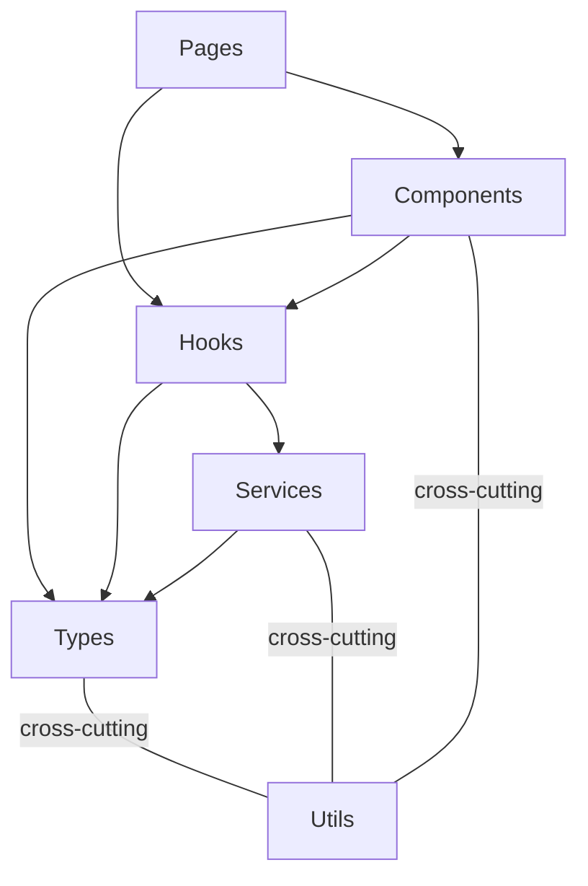

# Architecture — func-console

## Stack

React + TypeScript + PatternFly 6 + OCP Dynamic Plugin SDK

## Layered Architecture

Arrows mean "imports / depends on."

| Layer | Maps to | Depends on |
|-------|---------|------------|
| **Types** | `common/services/types.ts` | nothing |
| **Services** | `common/services/*/Service.ts` + implementations | Types, Utils |
| **Hooks** | `common/services/*/use*.ts`, `common/hooks/`, `pages/<name>/hooks/` | Services, Types, Utils |
| **Components** | `common/components/` (shared), `pages/<name>/components/` (page-specific) | Hooks, Types, Utils |
| **Pages** | `pages/<name>/` | Components, Hooks, Utils |
| **Utils** | `common/utils/` | nothing (cross-cutting) |

### Dependency Rules

- Unidirectional: Types <- Services <- Hooks <- Components <- Pages
- Utils can be imported by any layer
- Pages never import Services directly (always through Hooks)
- Services never import Components or Pages
- No circular dependencies

### Co-location Convention

- `src/pages/<name>/` contains the page component, its test, and a `components/` subdir
- `src/pages/<name>/components/` contains components used only by that page
- `src/common/` contains everything shared across pages (components, services, utils, context)
- **Ownership rule:** if a component is imported by only one page (test imports don't count), it lives in `pages/<name>/components/`. If imported by multiple pages, it lives in `common/components/`.

## React

### Pages

- **Smart for page-specific data** — pages use central hooks (e.g. `useClusterService`, `useSourceControl`) to fetch, prepare, and transform all data needed for downstream components.

### Components

- **Simple by default** — they receive data via props, render it, and call callbacks. No logic at the top of a component.
- **May own data when self-contained** — a component may own its own data and state when it encapsulates a self-contained capability that is not specific to any one page (e.g., forge connection, auth flows, notification subscriptions). The component becomes the single owner of that concern. Pages consume it without orchestrating its internals.
- **Sub-components** — if a sub-component is only used by one parent, keep it in the parent's file, unexported. Extract to its own file only when the sub-component is used by multiple siblings.

### Hooks

- **Extract logic into hooks** — if a page or component has any logic (state management, data transformation, side effects), extract it into a custom hook. If the hook is only used by one component, keep it in the same file, do not export it. If the hook is reused by multiple components within one page, put it in `src/pages/<name>/hooks/`. If reused across pages, put it in `src/common/hooks/`. If there is no logic, no hook is needed.

### Utility Functions

- **Same co-location rule as hooks** — if a utility function is only used by one component or hook, keep it in the same file, do not export it. If it is reused by multiple files within one page, put it in `src/pages/<name>/utils/`. If reused across pages, put it in `src/common/utils/`.

### File Ordering

Within a file, put the exported component at the top, then its hook below, then sub-components, then helper functions at the bottom. Readers see the main thing first and can drill down.

### Performance

- **No speculative memoization**: Do not wrap every function in `useCallback` or every value in `useMemo` as a habit. Use them when there is a concrete reason: a `React.memo` child that depends on a stable reference, or a known re-render path (e.g., a sibling component re-rendering on every keystroke). Plain functions and derived values are the default.

## Architectural Guidance

- PatternFly components preferred over custom HTML
- PatternFly styling and styling rules over custom CSS
- Error handling through ErrorProvider/addError pattern
- Shared utilities in `common/utils/`, not hand-rolled per component
- Services consumed through hooks, never imported directly
