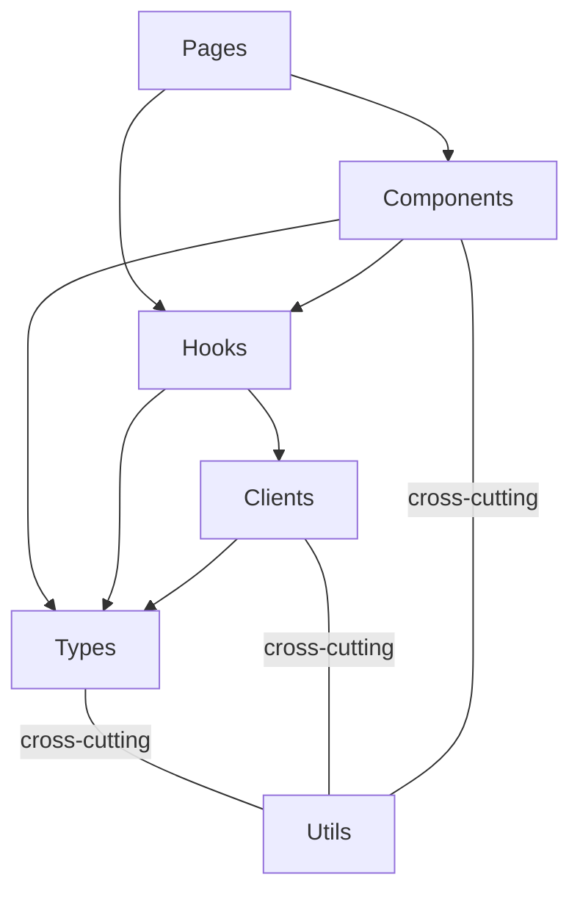

# Architecture — func-console

## Stack

React + TypeScript + PatternFly 6 + OCP Dynamic Plugin SDK

## Layered Architecture

```mermaid
flowchart TB
    TYPES[Types] ---|cross-cutting| UTILS[Utils]
    CLIENTS[Clients] ---|cross-cutting| UTILS
    COMPONENTS[Components] ---|cross-cutting| UTILS
    PAGES[Pages] --> COMPONENTS[Components]
    PAGES --> HOOKS[Hooks]
    COMPONENTS --> HOOKS
    COMPONENTS --> TYPES
    HOOKS --> CLIENTS[Clients]
    HOOKS --> TYPES
    CLIENTS --> TYPES[Types]
```

Arrows mean "imports / depends on."

| Layer | Maps to | Depends on |
|-------|---------|------------|
| **Types** | `common/types.ts` | nothing |
| **Clients** | `common/clients/` (plain async functions and hooks that wrap SDK calls) | Types, Utils |
| **Hooks** | `common/clients/use*.ts`, `common/hooks/`, `pages/<name>/hooks/` | Clients, Types, Utils |
| **Components** | `common/components/` (shared), `pages/<name>/components/` (page-specific) | Hooks, Types, Utils |
| **Pages** | `pages/<name>/` | Components, Hooks, Utils |
| **Utils** | `common/utils/` | nothing (cross-cutting) |

### Dependency Rules

- Unidirectional: Types <- Clients <- Hooks <- Components <- Pages
- Utils can be imported by any layer
- Pages and components may import clients and hooks directly
- Clients/hooks never import Components or Pages
- No circular dependencies

### Co-location Convention

- `src/pages/<name>/` contains the page component, its test, and a `components/` subdir
- `src/pages/<name>/components/` contains components used only by that page
- `src/common/` contains everything shared across pages (components, clients, utils, context)
- **Ownership rule:** if a component is imported by only one page (test imports don't count), it lives in `pages/<name>/components/`. If imported by multiple pages, it lives in `common/components/`.

## React

### Pages

- **Smart for page-specific data** -- pages use hooks (their co-located page hook, `useCluster`) to fetch, prepare, and transform all data needed for downstream components.

### Components

- **Simple by default** — they receive data via props, render it, and call callbacks. No logic at the top of a component.
- **May own data when self-contained** -- a component may own its own data and state when it encapsulates a self-contained capability that is not specific to any one page (e.g., auth flows, notification subscriptions). Such components may use hooks directly. The component becomes the single owner of that concern. Pages consume it without orchestrating its internals.
- **Sub-components** — if a sub-component is only used by one parent, keep it in the parent's file, unexported. Extract to its own file only when the sub-component is used by multiple siblings.

### Clients

`common/clients/` contains thin wrappers around external APIs. Two forms:

- **Plain async functions** (e.g., `functionsClient.ts`) -- stateless fetch wrappers that hooks call.
- **Hooks** (e.g., `useCluster.ts`) -- when the client wraps a React-aware SDK call such as `useK8sWatchResource`, it stays as a hook.

### Hooks

- **Extract logic into hooks** — if a page or component has any logic (state management, data transformation, side effects), extract it into a custom hook. If the hook is only used by one component, keep it in the same file, do not export it. If the hook is reused by multiple components within one page, put it in `src/pages/<name>/hooks/`. If reused across pages, put it in `src/common/hooks/`. If there is no logic, no hook is needed.

### Utility Functions

- **Same co-location rule as hooks** — if a utility function is only used by one component or hook, keep it in the same file, do not export it. If it is reused by multiple files within one page, put it in `src/pages/<name>/utils/`. If reused across pages, put it in `src/common/utils/`.

### File Ordering

Within a file, put the exported component at the top, then its hook below, then sub-components, then helper functions at the bottom. Readers see the main thing first and can drill down.

### Performance

- **No speculative memoization**: Do not wrap every function in `useCallback` or every value in `useMemo` as a habit. Use them when there is a concrete reason: a `React.memo` child that depends on a stable reference, or a known re-render path (e.g., a sibling component re-rendering on every keystroke). Plain functions and derived values are the default.

## Architectural Guidance

- PatternFly components preferred over custom HTML
- PatternFly styling and styling rules over custom CSS
- Error handling through ErrorProvider/addError pattern
- Shared utilities in `common/utils/`, not hand-rolled per component
- Clients consumed through hooks, never imported directly

---

## Backend (Go)

### Stack

Go + `net/http` standard library. Key dependencies:

| Dependency | Role |
|---|---|
| `k8s.io/client-go` | Kubernetes API client (SA, RBAC, TokenRequest, kubeconfig) |
| `google/go-github/v72` | GitHub API client |
| `knative.dev/func` | Function scaffold generation |
| `onsi/ginkgo` + `onsi/gomega` | Test framework |

### Packages

| Package | Responsibility |
|---|---|
| `kube` | Shared Kubernetes connection: builds a `*rest.Config` from host/token/caCert (or in-cluster), including the JSON content config and the default request timeout |
| `cluster` | Kubernetes provisioning: service account, RBAC provisioning, TokenRequest, kubeconfig generation |
| `functions` | Function lifecycle via knative/func: cluster queries behind the growable `functions.Client` facade (lists today), plus source/CI scaffold generation (`Generate`) |
| `handler` | HTTP handlers: input validation, orchestration, error mapping |
| `scm` | SCM abstraction types (`Platform`, `Registry`, `Client`) and filesystem helpers |
| `scm/github` | go-github implementation of `scm.Client` |
| `config` | Package-level wiring vars (`SCMRegistry`, constants) |

### Dependency Rules

- `handler` imports `cluster`, `functions`, `scm`, `config` — never the reverse
- `cluster` and `functions` both import `kube` for connection setup, and have no knowledge of each other
- `kube` imports only `k8s.io/client-go/rest`; it depends on no other backend package
- `cluster` is for provisioning (write RBAC/SA, request tokens); `functions` is for the function lifecycle (list and scaffold generation). Both talk to the cluster but answer different questions, so they stay separate rather than sharing one client interface
- `scm` has no knowledge of cluster or functions
- `functions` imports `scm` only for `scm.Platform` and `scm.FileEntry` types
- `config` is imported by `handler` and `main` only — it is the wiring layer

### Key Decisions

**Cluster access is split by intent: `cluster` (provisioning) vs `functions` (function lifecycle)**
Both talk to the same API server but answer different questions, so they are separate packages rather than one god-client. `cluster` writes RBAC/service accounts and mints tokens; `functions` owns the function lifecycle via knative/func. The shared connection logic lives in `kube.RESTConfig`, which both call, so host resolution, TLS, JSON content config, and the default request timeout are defined once. `kube` is a leaf (depends only on `client-go/rest`), which keeps it importable by any domain package without cycles — unlike `config`, the wiring layer, which is off-limits to domain packages.

**`functions` is the single knative/func facade, but splits offline scaffolding from cluster operations**
Everything that wraps `knative.dev/func` lives in this one package, so there is a single boundary around that dependency. Within it, two responsibilities are kept apart because they have different needs:

- `Generate` (`scaffold.go`) is **offline**: it scaffolds a new function's source and CI files into a temp dir and returns `scm.FileEntry` blobs to push to a repo. It never contacts the cluster and needs no REST config, so it is a plain package function, not a method on `Client`. It is called standalone from the create handler, before any cluster client exists.
- `functions.Client` (`client.go`) is the **cluster-connected** CRUD facade, built via `NewClient(host, token, caCert)` and holding a `*rest.Config`. It exposes `List` today; deploy/undeploy/describe are expected next, hence an interface rather than a bare `Lister`.

`Generate` is deliberately not folded into `Client`: it would ignore the receiver's config entirely, and callers that only scaffold (the create handler) would be forced to build a cluster client with a host and tokens they do not need. Scaffolding produces repo source, not a cluster resource; the cluster-level "create" (deploy) will land on `Client` when it arrives.

**Cluster host resolution: explicit parameter via `--kube-host` flag**
`cluster.New(host, token, caCert)` and `functions.NewClient(...)` accept the API server URL as an explicit parameter and pass it to `kube.RESTConfig`. Empty host triggers `rest.InClusterConfig()` (production pods). In dev, `hack/dev.sh` passes `--kube-host $KUBE_API_SERVER` to the backend binary; in tests, it is passed directly. Env var injection (`KUBERNETES_SERVICE_HOST`) was explicitly rejected as it abuses a Kubernetes-standardized variable and creates hidden ambient state.

**External API URL resolved at Helm install time**
The URL embedded in generated kubeconfigs (`externalAPIServerURL`) comes from the Infrastructure CR (`config.openshift.io/v1/Infrastructure/cluster`) via Helm `lookup` at install time, injected as `--external-api-server-url`. It is not fetched at runtime. This eliminates the need for a `ClusterRole` to query the Infrastructure CR from within the pod.

**SCM is abstracted behind a registry**
`scm.Registry` maps `scm.Platform` → `scm.ClientFactory`. The active registry lives at `config.SCMRegistry`, a package-level var that tests swap out via `withSCMMock`. Handlers never reference a concrete SCM client type. The platform is currently resolved statically (`scm.DefaultPlatform = GitHub`), but the registry is designed to support dynamic platform selection — the handler can later derive the platform from the request body or header without changes to the registry or client implementations.

**Handler error mapping**
`createFunction` wraps upstream failures explicitly:

| Error | HTTP status |
|---|---|
| `scm.ErrUnauthorized` | 401 |
| `scm.ErrRepoExists` | 409 |
| `errUpstream` (cluster or SCM failure) | 502 |
| validation failure | 400 |
| internal error | 500 |

**Handlers are stateless**
`Handlers` holds only static config. Every request creates its own cluster client authenticated with the caller's OCP bearer token — there is no shared connection or session.
